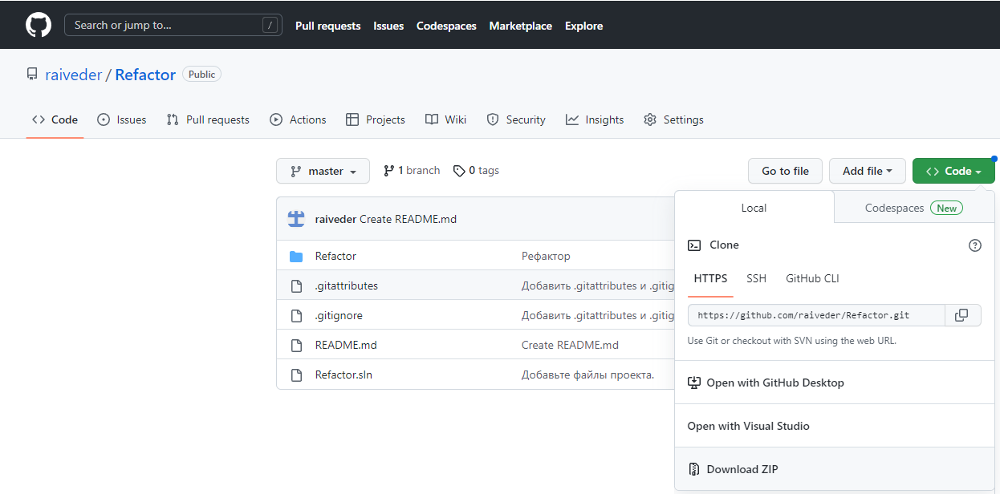
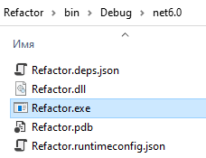
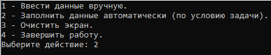
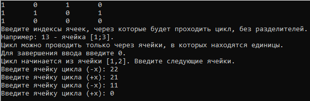
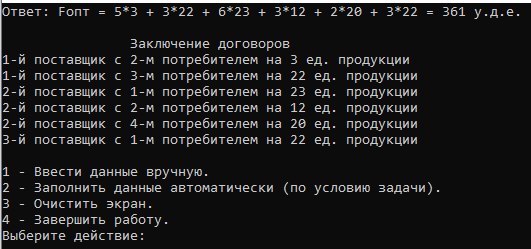

# Метод потенциалов

Программа позволяет произвести расчёт оптимального распределения методом потенциалов. Такая задача наиболее часто встречается в математическом моделировании. Она является разновидностью транспортной задачи.

## Начало работы

Для начала работы необходимо перейти по ссылке на [репозиторий](https://github.com/raiveder/Refactor) и скачать архив с файлами программы.
</br></br>


### Необходимые условия

Для установки программы потребуется соблюдение следующих факторов:
- [X] ОС Windows 7-10
- [X] 1,5 Мб свободного пространства на накопителе
- [X] Microsoft Visual Studio 2022
  - [X] Пакет "Разработка классических приложений .NET"

### Установка

После скачивания архива с файлами программы необходимо распаковать его в удобный Вам каталог. Для этого потребуется нажать на архив правой кнопкой мыши и выбрать пункт *"Извлечь файлы"*.
</br>
После извлечения файлов перейдите в папку с распакованным архивом зайдите в папку *"Refactor"* и откройте файл *"Refactor.sln"*. Если будет предложен выбор приложения - выберите **Microsoft Visual Studio 2022**.
</br>
После запуска Visual Studio нажмите на зелёный треугольник вверху окна.
</br></br>

</br></br>
Далее необходимо следовать инструкциям, которые даёт программа.
</br>
Для повторного запуска можно снова воспользоваться зелёным треугольником или перейти в папку, где находится файл *"Refactor.sln"*, далее перейти в папку *"Refactor\bin\Debug\net6.0\"* и запустить файл *"Refactor.exe"*
</br></br>


### Пример работы

Запустите программу одним из вышеописанных способов. В предложенном меню выберите цифру 2 для автоматического заполнения данных и нажмите клавишу *"Enter"*.
</br></br>

</br></br>
Далее Вам будет предложено ввести ячейки, через которые будет проходить цикл перераспределения. Для выполнения этого шага, согласно инструкциям на экране, введите ячейки цикла как показано на рисунке, затем снова нажмите клавишу *"Enter"*.
</br></br>

</br></br>
Не стоит бояться ввести некорректные данные, так как программа сумеет правильно их обработать и сохранить работоспособность
```C#
private static int InputM()
        {
            while (true)
            {
                Console.Write("Введите количество поставщиков: ");
                if (int.TryParse(Console.ReadLine(), out int m) && m > 1 && m < 11)
                {
                    return m;
                }
                Console.WriteLine("Ошибка. Введите значение корректно!");
            }
        }
```
</br></br>

</br></br>
Теперь на экране отобразится результат расчёта целевой функции и порядок заключения договоров между поставщиками и потребтелями.
</br></br>

</br></br>
Для произвольного ввода начальных данных в меню требуется выбрать цифру 1. Далее необходимо действовать согласно инструкциям на экране.

### Разбор кода

Для понимания алгоритма работы программы при автоматическом заполнении данных следует изучить приведённый ниже код.
```C#
private static void Fill()
        {
            _matr = new int[3, 4];
            _matr[0, 0] = 9;
            _matr[0, 1] = 5;
            _matr[0, 2] = 3;
            _matr[0, 3] = 10;
            _matr[1, 0] = 6;
            _matr[1, 1] = 3;
            _matr[1, 2] = 8;
            _matr[1, 3] = 2;
            _matr[2, 0] = 3;
            _matr[2, 1] = 8;
            _matr[2, 2] = 4;
            _matr[2, 3] = 7;

            _mConst = new int[3];
            _mConst[0] = 25;
            _mConst[1] = 55;
            _mConst[2] = 22;

            _nConst = new int[4];
            _nConst[0] = 45;
            _nConst[1] = 15;
            _nConst[2] = 22;
            _nConst[3] = 20;
        }
```
Для проверки работоспособности программы можно вручную решить данную задачу и сверить результат.

Также код снабжён поясняющими комментариями, что должно помочь разобраться в логике работы алгоритма нахождения оптимального распределения.
```C#
/// <summary>
        /// Вывод порядка заключения договоров
        /// </summary>
        /// <param name="divisionArray">Распределение</param>
        /// <param name="countM">Количество поставщиков</param>
        /// <param name="countN">Количество потребителей</param>
        private static void ShowContracts(int[,] divisionArray, int countM, int countN)
        {
            Console.WriteLine("\t\tЗаключение договоров");
            for (int i = 0; i < countM; i++)
            {
                for (int j = 0; j < countN; j++)
                {
                    if (divisionArray[i, j] > 0)
                    {
                        Console.WriteLine("{0}-й поставщик с {1}-м потребителем на {2} ед. продукции", i + 1, j + 1, divisionArray[i, j]);
                    }
                }
            }
            Console.WriteLine();
        }
```

## Авторы

**Сергеев Дмитрий**
</br>
**Группа - 41П**
</br>
Больше работ - *[клик](https://github.com/raiveder?tab=repositories).*
